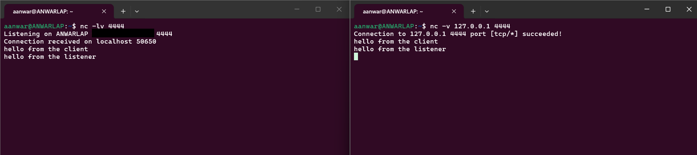

# Day 2 — Networking Fundamentals

Task: open a listener with `nc` and connect to it from another terminal, test an HTTP endpoint with `curl -v`, then add a firewall rule that blocks a port and show evidence that it took effect.

## Setup

Everything ran in WSL2 (Ubuntu 22.04) on a Windows 11 host. WSL2 is a virtual machine with its own kernel and network interface, so Windows and Ubuntu are separate machines on a virtual network. That provided a real external client for the firewall test without needing a second computer.

| Item | Value |
|---|---|
| Distro | Ubuntu 22.04 (WSL2), `systemd` as PID 1 |
| WSL guest IP (`eth0`) | `172.30.69.109/20` |
| Gateway — the Windows host | `172.30.64.1` |
| Test server | `python3 -m http.server 8080`, run from `~/netlab` |
| Firewall | `ufw` 0.36, over `iptables` 1.8.7 (`nf_tables` backend) |

`ufw` needs `systemd`, which is not enabled in every WSL install. Confirmed with `ps -p 1 -o comm=`.

The guest IP is assigned by the host and changes on most WSL restarts, so anything referencing `172.30.69.109` needs `ip -4 addr show eth0` re-run first.

## 1. Ports and the client-server model (`nc`)

`nc` can act as either a server or a client, with no protocol on top.

Terminal A, listening:

```bash
nc -lv 4444
```

Terminal B, checking the socket exists before connecting to it:

```bash
ss -ltnp | grep 4444
nc -v 127.0.0.1 4444
```

```
LISTEN 0  1  0.0.0.0:4444  0.0.0.0:*  users:(("nc",pid=896,fd=3))
```

`ss` flags: `-l` listening sockets only, `-t` TCP, `-n` numeric (skips DNS lookups, which can otherwise stall the output), `-p` show the owning process.

The `0.0.0.0` is the part that matters. It is a wildcard meaning the socket accepts connections on every interface. Had it read `127.0.0.1:4444`, the server would only accept connections from inside the guest and would be unreachable from Windows regardless of firewall configuration — worth checking before suspecting a firewall for a connection failure.

Text typed in either terminal appeared in the other, in both directions:



## 2. HTTP with `curl -v`

A local server, so both ends of the exchange were visible:

```bash
mkdir -p ~/netlab && cd ~/netlab
echo "<h1>netlab OK</h1>" > index.html
python3 -m http.server 8080
```

```bash
curl -v http://127.0.0.1:8080
```

```
*   Trying 127.0.0.1:8080...
* Connected to 127.0.0.1 (127.0.0.1) port 8080 (#0)
> GET / HTTP/1.1
> Host: 127.0.0.1:8080
> User-Agent: curl/7.81.0
> Accept: */*
>
* HTTP 1.0, assume close after body
< HTTP/1.0 200 OK
< Server: SimpleHTTP/0.6 Python/3.10.12
< Content-type: text/html; charset=utf-8
< Content-Length: 19
<
<h1>netlab OK</h1>
* Closing connection 0
```

`curl -v` marks each line by origin: `*` is curl's own commentary, `>` is what was sent to
the server, `<` is what came back. The blank line after the headers is what tells the server
the request is finished.

curl sent `HTTP/1.1` but the server answered `HTTP/1.0`, hence "assume close after body" —
Python's `SimpleHTTP` only speaks HTTP/1.0, which closes the connection after each response
rather than keeping it open for reuse.

`python3 -m http.server` serves whatever directory it is started in, to anyone who can reach
the port, so it was run from a scratch directory containing only `index.html`.

## 3. Firewall rule (`ufw`)

### 3.1 Why the test needs an external client

`ufw` accepts all traffic arriving on the loopback interface before any user rule is
evaluated — `iptables -S` shows `-A ufw-before-input -i lo -j ACCEPT` in the chain that runs
ahead of the one holding user rules. A same-host test therefore cannot demonstrate a rule.

WSL2 complicates this further: a connection to `127.0.0.1:8080` from Windows is forwarded
into the guest and delivered on the guest's loopback interface, so it bypasses the firewall
too. Only the guest's real address crosses `eth0`.

```
   WINDOWS HOST                                  UBUNTU (WSL2 GUEST)

A) client -> 127.0.0.1:8080 ---- WSL relay ---->  lo     not filtered
B) client -> 172.30.69.109:8080 - virtual sw -->  eth0   filtered
```

Three terminals were used: **A** running the server, **B** running `ufw` commands and
loopback tests inside the guest, **C** a Windows PowerShell acting as the external client.

In PowerShell the binary must be called as `curl.exe`; plain `curl` is an alias for
`Invoke-WebRequest`, which takes different flags.

### 3.2 Baseline, firewall off

```bash
sudo ufw status verbose        # Status: inactive
```

```powershell
curl.exe -v --max-time 5 http://172.30.69.109:8080
```

```
> GET / HTTP/1.1
> Host: 172.30.69.109:8080
< HTTP/1.0 200 OK
< Content-Length: 19
<
<h1>netlab OK</h1>
```

Establishing this before adding any rule is what makes the later failure attributable to the
firewall. → `verification/01-ufw-inactive.txt`

### 3.3 Default policy

```bash
sudo ufw --force enable
sudo ufw status numbered       # Status: active, no user rules
```

No rules exist yet, but Terminal C now times out, blocked by the default `deny (incoming)`
policy. At the same moment, from inside the guest:

```bash
curl -s --max-time 5 http://127.0.0.1:8080
# <h1>netlab OK</h1>
```

The same port is blocked from outside and open from inside, which is the loopback bypass
described in 3.1. → `verification/02-ufw-enabled-no-rules.txt`

### 3.4 Allow rule

```bash
sudo ufw allow 8080/tcp
sudo ufw status numbered
```

```
     To                         Action      From
     --                         ------      ----
[ 1] 8080/tcp                   ALLOW IN    Anywhere
[ 2] 8080/tcp (v6)              ALLOW IN    Anywhere (v6)
```

Terminal C returns `HTTP/1.0 200 OK` again. `ufw` writes both an IPv4 and an IPv6 rule
because `IPV6=yes` in `/etc/default/ufw`. Naming the protocol matters: a bare `ufw allow
8080` would open UDP as well. → `verification/03-allow-8080.txt`

### 3.5 Deny rule, and the evidence

```bash
sudo ufw logging medium
sudo ufw deny log 8080/tcp
sudo ufw status numbered
```

```
     To                         Action      From
     --                         ------      ----
[ 1] 8080/tcp                   DENY IN     Anywhere                   (log)
[ 2] 8080/tcp (v6)              DENY IN     Anywhere (v6)              (log)
```

The rule list stayed at two entries rather than growing: `ufw` identifies a rule by its match
criteria, not its action, so re-issuing the same port and protocol with a different action
updates the existing entry in place.

The `log` keyword is required. Without it the traffic is still dropped but nothing is
recorded, which makes such a rule awkward to debug.

Terminal C:

```
*   Trying 172.30.69.109:8080...
* Connection timed out after 5014 milliseconds
```

It times out rather than failing immediately because `deny` drops the packet silently. `ufw
reject` would send a refusal instead and the client would fail at once.

The kernel log for the same attempt:

```bash
dmesg | grep "UFW BLOCK" | grep "DPT=8080"
```

```
[15791.595375] [UFW BLOCK] IN=eth0 SRC=172.30.64.1 DST=172.30.69.109 PROTO=TCP SPT=65518 DPT=8080 ... SYN
[15792.598420] [UFW BLOCK] IN=eth0 SRC=172.30.64.1 DST=172.30.69.109 PROTO=TCP SPT=65518 DPT=8080 ... SYN
[15794.606256] [UFW BLOCK] IN=eth0 SRC=172.30.64.1 DST=172.30.69.109 PROTO=TCP SPT=65518 DPT=8080 ... SYN
```

`IN=eth0` confirms the packet arrived on the external interface rather than loopback,
`SRC` is the Windows host, and `DPT=8080` is the port named in the rule. The three lines are
one `curl` attempt, not three: with no reply, TCP retransmitted the opening `SYN` at roughly
0s, 1s and 3s and each retry was dropped, which is why the client gave up at 5014 ms.
→ `verification/05-kernel-log-deny-rule.txt`

A capture from the loopback test in 3.3 shows the contrast — same port, but logged as
`AUDIT` and never `BLOCK`, because the kernel allowed it:

```
[2519.923979] [UFW AUDIT] IN=lo SRC=127.0.0.1 DST=127.0.0.1 PROTO=TCP DPT=8080 ... SYN
```

→ `verification/06-kernel-log-loopback-comparison.txt`

### 3.6 Rule ordering

Re-issuing a rule with identical criteria replaces it (3.5). Rules whose criteria differ
coexist, and then order decides the outcome. Adding a source-restricted allow alongside the
existing deny:

```bash
sudo ufw allow from 172.30.64.0/20 to any port 8080 proto tcp
sudo ufw status numbered
```

```
     To                         Action      From
     --                         ------      ----
[ 1] 8080/tcp                   ALLOW IN    172.30.64.0/20
[ 2] 8080/tcp                   DENY IN     Anywhere
[ 3] 8080/tcp (v6)              DENY IN     Anywhere (v6)
```

`from 172.30.64.0/20` limits the rule to hosts on the WSL virtual network, `to any` is any
local address, `port 8080 proto tcp` is the destination port and protocol.

`ufw` evaluates top-down and stops at the first match. The Windows host at `172.30.64.1`
falls inside `172.30.64.0/20`, so it matches rule [1] and never reaches the deny at [2].
Terminal C returned `HTTP/1.0 200 OK` with that deny rule still listed and active — a rule
being present in `ufw status` is not the same as it being reached.

The allow was removed afterwards so it would not interfere with the rule under test:

```bash
sudo ufw delete allow from 172.30.64.0/20 to any port 8080 proto tcp
```

→ `verification/07-rule-ordering.txt`

## 4. Cleanup

```bash
sudo ufw delete deny log 8080/tcp
sudo ufw --force disable
sudo ufw status verbose        # Status: inactive
```

The test server was stopped with `Ctrl+C`.

Worth noting for later: `ufw enable` also sets the `FORWARD` policy to `DROP`, which breaks
networking for Docker containers running on the same host.

## 5. Verification files

| File | Contents |
|---|---|
| `verification/01-ufw-inactive.txt` | `ufw status verbose` before enabling |
| `verification/02-ufw-enabled-no-rules.txt` | `ufw status numbered` after enable, no user rules |
| `verification/03-allow-8080.txt` | `ufw status numbered` with the ALLOW rule |
| `verification/04-deny-8080.txt` | `ufw status numbered` with the DENY rule |
| `verification/05-kernel-log-deny-rule.txt` | `[UFW BLOCK]` lines from the `deny log 8080/tcp` rule |
| `verification/06-kernel-log-loopback-comparison.txt` | Default-policy block, plus the `IN=lo` AUDIT-only line |
| `verification/07-rule-ordering.txt` | ALLOW at [1] shadowing DENY at [2] |
| `verification/08-nc-two-way-chat.png` | Screenshot of the `nc` listener and client exchanging text |

## 6. Commands used, and why

| Command | Purpose |
|---|---|
| `nc -lv 4444` | Opens a TCP listener. `-l` listen, `-v` report connections. Add `-k` to keep it open past the first client. |
| `nc -v 127.0.0.1 4444` | Connects to a listener as a client. |
| `ss -ltnp` | Lists listening TCP sockets with their owning process, used to confirm the bind address before testing connectivity. |
| `curl -v http://host:port` | Sends an HTTP request and prints the request and response headers alongside the body. |
| `curl.exe --max-time 5 ...` | Same from Windows PowerShell. `.exe` avoids the `Invoke-WebRequest` alias; `--max-time` stops the client hanging when packets are dropped. |
| `sudo ufw enable` / `disable` | Turns the firewall on or off. `--force` skips the interactive SSH warning. |
| `sudo ufw status numbered` | Lists rules with their evaluation order. |
| `sudo ufw allow 8080/tcp` | Permits inbound TCP on a port. |
| `sudo ufw deny log 8080/tcp` | Drops inbound TCP on a port and logs each drop. |
| `sudo ufw delete <rule>` | Removes a rule, repeating the original rule text. |
| `sudo ufw logging medium` | Raises log verbosity so blocked and new connections are recorded. |
| `sudo iptables -S` | Shows the rules `ufw` generated, including the loopback accept that runs ahead of user rules. |
| `dmesg \| grep UFW` | Reads the kernel firewall log. |
| `ip -4 addr show eth0` | Shows the guest's current IP, which changes across WSL restarts. |

## Man pages consulted

`man nc`, `man curl`, `man ss`, `man ufw`, `man iptables`, `man dmesg`.
